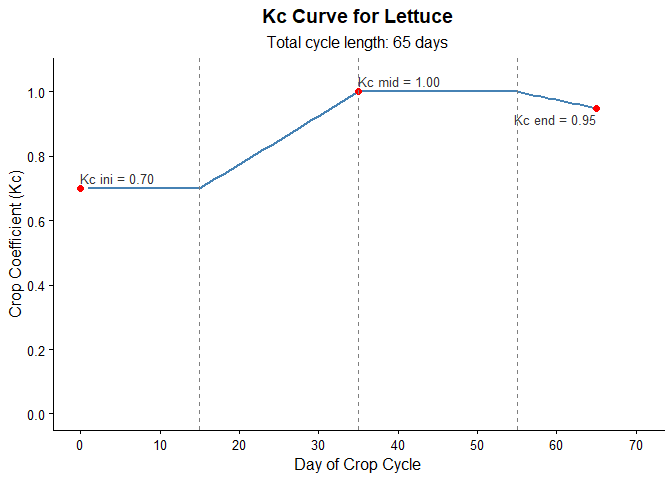

<!-- badges: start -->

[](https://github.com/joaobtj/irritool/actions/workflows/R-CMD-check.yaml)
[](https://lifecycle.r-lib.org/articles/stages.html#experimental)
<!-- badges: end -->

# irritool

The **irritool** package provides computational tools in R for
irrigation.

## Installation

You can install the development version of irritool from
[GitHub](https://github.com/) with:

``` r
# install.packages("devtools")
devtools::install_github("joaobtj/irritool")
```

## Main Features

- `extract_brdwgd_point()`: Extracts time series of meteorological
  variables (precipitation, ETo, temperatures, radiation, etc.) for
  specific coordinates from the BR-DWGD gridded database NetCDF files
  (Xavier et al.).
- `calc_kc_curve()`: Builds the daily crop coefficient (Kc) time series
  based on the four development stages of the FAO-56 methodology,
  returning the numeric values and a ready-to-use `ggplot2` chart.
- `calc_water_balance()`: Calculates the daily soil water balance for
  the crop, estimating actual evapotranspiration (ETc), water deficit,
  irrigation requirements, and water surplus (deep percolation/runoff).

## Example Usage

Below is a basic workflow showing how the package functions integrate to
simulate a crop cycle.

``` r
library(irritool)

# 1. Obtain climate data for a coordinate (requires local NetCDF files)
# As this is a reproducible example, we leave the extraction commented out:
# climate_data <- extract_brdwgd_point(
#   target_longitude = -50.59,
#   target_latitude = -27.28,
#   weather_variables = c("pr", "ETo"),
#   nc_files_directory = "path/to/files"
# )

# For this example, we will use mock climate data:
cycle_days <- 65
set.seed(123)
rain_data <- sample(c(rep(0, 60), runif(5, 5, 25)))
eto_data <- runif(cycle_days, 3, 5)

# 2. Generate the Kc curve for the crop (e.g., Lettuce)
lettuce_kc <- calc_kc_curve(
  kc_points = c(0.7, 1.0, 0.95),
  stage_lengths = c(15, 20, 20, 10),
  crop = "Lettuce"
)

# View the generated plot
print(lettuce_kc$kc_plot)
```



``` r
# 3. Simulate the soil water balance
water_balance <- calc_water_balance(
  et0 = eto_data,
  rainfall = rain_data,
  daily_kc_values = lettuce_kc$kc_serie, # Consuming the output from the previous function
  root_depth = 300,
  theta_fc = 0.30,
  theta_wp = 0.15,
  depletion_factor = 0.55,
  irrigation_rule = "threshold"
)

# View the first few days of the soil water balance
head(water_balance$water_balance_data)
#>   day rainfall      et0 root_depth taw   raw depletion_start  kc ks      etc
#> 1   1        0 4.564589        300  45 24.75        0.000000 0.7  1 3.195212
#> 2   2        0 3.187190        300  45 24.75        3.195212 0.7  1 2.231033
#> 3   3        0 3.933558        300  45 24.75        5.426245 0.7  1 2.753491
#> 4   4        0 4.023011        300  45 24.75        8.179736 0.7  1 2.816108
#> 5   5        0 4.199978        300  45 24.75       10.995843 0.7  1 2.939985
#> 6   6        0 3.665647        300  45 24.75       13.935828 0.7  1 2.565953
#>   depletion_end irrigation_applied water_surplus
#> 1      3.195212                  0             0
#> 2      5.426245                  0             0
#> 3      8.179736                  0             0
#> 4     10.995843                  0             0
#> 5     13.935828                  0             0
#> 6     16.501781                  0             0

# View the summary depths (totals)
print(water_balance$summary_depths)
#> $total_rainfall
#> [1] 91.16689
#> 
#> $total_water_surplus
#> [1] 35.75595
#> 
#> $net_rainfall
#> [1] 55.41094
#> 
#> $total_etc
#> [1] 228.1546
#> 
#> $total_irrigation_applied
#> [1] 158.6104
#> 
#> $irrigation_events_count
#> [1] 6
```

## References

- Allen, R. G., Pereira, L. S., Raes, D., & Smith, M. (1998). *Crop
  evapotranspiration - Guidelines for computing crop water
  requirements*. FAO Irrigation and drainage paper 56.
- Xavier, A. C., King, C. W., & Scanlon, B. R. (2016). Daily gridded
  meteorological variables in Brazil (1980–2013). *International Journal
  of Climatology*.
