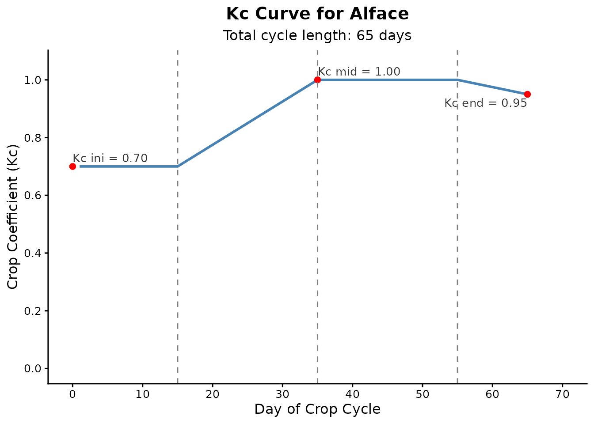

# Balanço Hídrico Diário para Irrigação

O pacote **irritool** está em contínuo desenvolvimento e oferece um
conjunto crescente de ferramentas em R para a modelagem do sistema
solo-água-planta-atmosfera. Embora o pacote inclua recursos para a
extração de dados climáticos em grade e outras análises agronômicas,
este tutorial foca especificamente no fluxo de trabalho central do
manejo de irrigação.

Abaixo, demonstramos os passos fundamentais para estimar as necessidades
hídricas de uma cultura e simular o balanço hídrico diário do solo, o
que é muito útil para o planejamento de safras e análises de déficit
hídrico.

## 1. Preparando os Dados Climáticos

Para calcular o balanço de água no solo, o primeiro passo é obter dados
meteorológicos diários. Para este exemplo didático, vamos simular 65
dias de dados de evapotranspiração de referência (ET0) e precipitação
diretamente no R.

``` r
library(irritool)

# Simulando 65 dias de dados climáticos para o ciclo da cultura
dias_ciclo <- 65
set.seed(42)

# ET0 em mm/dia
eto_sim <- round(runif(dias_ciclo, 3, 6), 1)

# Chuva em mm/dia (maior parte dos dias secos com alguns eventos isolados de chuva)
chuva_sim <- round(sample(c(rep(0, 55), runif(10, 5, 30))), 0)
```

## 2. Construindo a Curva do Coeficiente de Cultura (Kc)

As culturas consomem água em taxas diferentes dependendo da sua fase
fenológica. A função
[`calc_kc_curve()`](https://joaobtj.github.io/irritool/reference/calc_kc_curve.md)
utiliza a metodologia da FAO-56 para construir a série diária de Kc.

Vamos simular um ciclo de 65 dias para uma hortaliça (ex: Alface),
dividida em quatro fases: Inicial, Desenvolvimento da Cultura, Fase
Intermediária e Fase Final.

``` r
# Definindo os parâmetros de Kc e a duração das fases (em dias)
parametros_kc <- c(0.7, 1.0, 0.95)
fases <- c(15, 20, 20, 10)

curva_alface <- calc_kc_curve(
  kc_points = parametros_kc,
  stage_lengths = fases,
  crop = "Alface"
)

# Visualizando o gráfico gerado automaticamente
curva_alface$kc_plot
```



## 3. Simulando o Balanço Hídrico no Solo

Com os dados climáticos e os valores diários de Kc estabelecidos,
podemos rodar a simulação da umidade do solo. A função
[`calc_water_balance()`](https://joaobtj.github.io/irritool/reference/calc_water_balance.md)
monitora a Capacidade Total de Água Disponível (TAW), a Água Facilmente
Disponível (RAW) e a depleção atual (déficit).

Utilizaremos a regra de irrigação por limite (`"threshold"`), que aplica
água automaticamente sempre que a depleção do solo ultrapassar a RAW,
garantindo que a planta não sofra estresse hídrico.

``` r
# Parâmetros do solo e sistema radicular
profundidade_raiz <- 300  # mm
umidade_cc <- 0.30        # Capacidade de campo (m3/m3)
umidade_pmp <- 0.15       # Ponto de murcha permanente (m3/m3)
fator_p <- 0.55           # Fator de depleção (p)

resultado_balanco <- calc_water_balance(
  et0 = eto_sim,
  rainfall = chuva_sim,
  daily_kc_values = curva_alface$kc_serie,
  root_depth = profundidade_raiz,
  theta_fc = umidade_cc,
  theta_wp = umidade_pmp,
  depletion_factor = fator_p,
  initial_depletion = 0, # Iniciando na capacidade de campo
  irrigation_rule = "threshold"
)
```

### Analisando os Resultados

A função retorna tanto os dados diários detalhados quanto um resumo dos
totais acumulados ao longo do ciclo.

``` r
# Verificando as lâminas totais para o ciclo completo
resultado_balanco$summary_depths
#> $total_rainfall
#> [1] 133
#> 
#> $total_water_surplus
#> [1] 17.755
#> 
#> $net_rainfall
#> [1] 115.245
#> 
#> $total_etc
#> [1] 271.7475
#> 
#> $total_irrigation_applied
#> [1] 156.5025
#> 
#> $irrigation_events_count
#> [1] 6
```

O sumário mostra exatamente qual foi a lâmina total de irrigação
aplicada e quantos eventos de irrigação foram acionados para manter a
cultura fora da zona de estresse.

Também podemos inspecionar o registro diário detalhado para analisar a
dinâmica da água dia a dia:

``` r
# Visualizando os primeiros 10 dias do balanço
head(resultado_balanco$water_balance_data, 10)
#>    day rainfall et0 root_depth taw   raw depletion_start  kc ks  etc
#> 1    1        0 5.7        300  45 24.75            0.00 0.7  1 3.99
#> 2    2        0 5.8        300  45 24.75            3.99 0.7  1 4.06
#> 3    3        0 3.9        300  45 24.75            8.05 0.7  1 2.73
#> 4    4        0 5.5        300  45 24.75           10.78 0.7  1 3.85
#> 5    5        0 4.9        300  45 24.75           14.63 0.7  1 3.43
#> 6    6        0 4.6        300  45 24.75           18.06 0.7  1 3.22
#> 7    7        0 5.2        300  45 24.75           21.28 0.7  1 3.64
#> 8    8        0 3.4        300  45 24.75            0.00 0.7  1 2.38
#> 9    9        0 5.0        300  45 24.75            2.38 0.7  1 3.50
#> 10  10        0 5.1        300  45 24.75            5.88 0.7  1 3.57
#>    depletion_end irrigation_applied water_surplus
#> 1           3.99               0.00             0
#> 2           8.05               0.00             0
#> 3          10.78               0.00             0
#> 4          14.63               0.00             0
#> 5          18.06               0.00             0
#> 6          21.28               0.00             0
#> 7          24.92              24.92             0
#> 8           2.38               0.00             0
#> 9           5.88               0.00             0
#> 10          9.45               0.00             0
```
