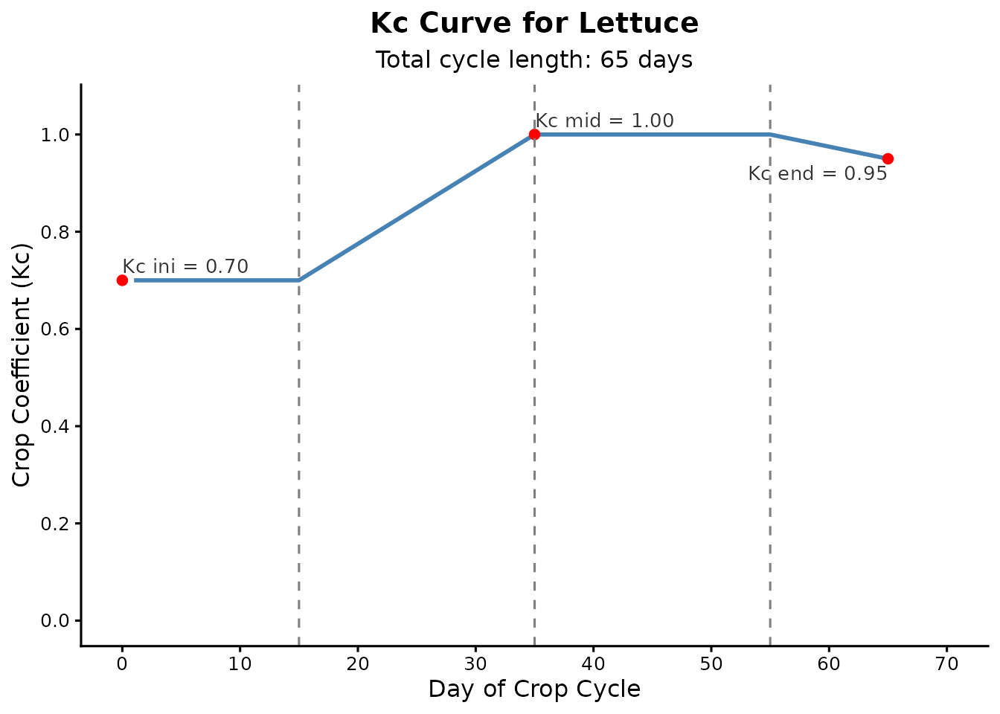

# Daily Soil Water Balance for Irrigation

The **irritool** package is continuously developing and offers a growing
set of R tools for modeling the soil-water-plant-atmosphere system.
While the package includes features for extracting gridded climate data
and other agronomic analyses, this tutorial focuses specifically on the
core irrigation management workflow.

Below, we demonstrate the fundamental steps to estimate crop water
requirements and simulate the daily soil water balance, which is highly
useful for crop planning and water deficit analysis.

## 1. Preparing Climate Data

To calculate the soil water balance, the first step is to obtain daily
meteorological data. For this educational example, we will simulate 65
days of reference evapotranspiration (ET0) and rainfall data directly in
R.

``` r
library(irritool)

# Simulating 65 days of climate data for the crop cycle
cycle_days <- 65
set.seed(42)

# ET0 in mm/day
eto_sim <- round(runif(cycle_days, 3, 6), 1)

# Rainfall in mm/day (mostly dry days with some isolated rain events)
rain_sim <- round(sample(c(rep(0, 55), runif(10, 5, 30))), 0)
```

## 2. Building the Crop Coefficient (Kc) Curve

Crops consume water at different rates depending on their phenological
stage. The
[`calc_kc_curve()`](https://joaobtj.github.io/irritool/reference/calc_kc_curve.md)
function uses the FAO-56 methodology to build the daily Kc series.

Let’s simulate a 65-day vegetable crop cycle (e.g., Lettuce), divided
into four stages: Initial, Crop Development, Mid-Season, and
Late-Season.

``` r
# Defining Kc parameters and stage lengths (in days)
kc_params <- c(0.7, 1.0, 0.95)
stages <- c(15, 20, 20, 10)

lettuce_curve <- calc_kc_curve(
  kc_points = kc_params,
  stage_lengths = stages,
  crop = "Lettuce"
)

# Viewing the automatically generated plot
lettuce_curve$kc_plot
```



## 3. Simulating the Soil Water Balance

With the climate data and daily Kc values established, we can run the
soil moisture simulation. The
[`calc_water_balance()`](https://joaobtj.github.io/irritool/reference/calc_water_balance.md)
function monitors the Total Available Water (TAW), Readily Available
Water (RAW), and the current depletion (deficit).

We will use the `"threshold"` irrigation rule, which automatically
applies water whenever the soil depletion exceeds the RAW, ensuring the
plant does not suffer from water stress.

``` r
# Soil and root system parameters
root_depth_val <- 300  # mm
theta_fc_val <- 0.30   # Field capacity (m3/m3)
theta_wp_val <- 0.15   # Wilting point (m3/m3)
p_factor_val <- 0.55   # Depletion factor (p)

balance_results <- calc_water_balance(
  et0 = eto_sim,
  rainfall = rain_sim,
  daily_kc_values = lettuce_curve$kc_serie,
  root_depth = root_depth_val,
  theta_fc = theta_fc_val,
  theta_wp = theta_wp_val,
  depletion_factor = p_factor_val,
  initial_depletion = 0, # Starting at field capacity
  irrigation_rule = "threshold"
)
```

### Analyzing the Results

The function returns both the detailed daily data and a summary of the
accumulated totals over the cycle.

``` r
# Checking the total depths for the entire cycle
balance_results$summary_depths
#> $total_rainfall
#> [1] 133
#> 
#> $total_water_surplus
#> [1] 17.755
#> 
#> $net_rainfall
#> [1] 115.245
#> 
#> $total_etc
#> [1] 271.7475
#> 
#> $total_irrigation_applied
#> [1] 156.5025
#> 
#> $irrigation_events_count
#> [1] 6
```

The summary shows exactly how much total irrigation was applied and how
many irrigation events were triggered to keep the crop out of the stress
zone.

We can also inspect the detailed daily log to analyze the water dynamics
day by day:

``` r
# Viewing the first 10 days of the balance
head(balance_results$water_balance_data, 10)
#>    day rainfall et0 root_depth taw   raw depletion_start  kc ks  etc
#> 1    1        0 5.7        300  45 24.75            0.00 0.7  1 3.99
#> 2    2        0 5.8        300  45 24.75            3.99 0.7  1 4.06
#> 3    3        0 3.9        300  45 24.75            8.05 0.7  1 2.73
#> 4    4        0 5.5        300  45 24.75           10.78 0.7  1 3.85
#> 5    5        0 4.9        300  45 24.75           14.63 0.7  1 3.43
#> 6    6        0 4.6        300  45 24.75           18.06 0.7  1 3.22
#> 7    7        0 5.2        300  45 24.75           21.28 0.7  1 3.64
#> 8    8        0 3.4        300  45 24.75            0.00 0.7  1 2.38
#> 9    9        0 5.0        300  45 24.75            2.38 0.7  1 3.50
#> 10  10        0 5.1        300  45 24.75            5.88 0.7  1 3.57
#>    depletion_end irrigation_applied water_surplus
#> 1           3.99               0.00             0
#> 2           8.05               0.00             0
#> 3          10.78               0.00             0
#> 4          14.63               0.00             0
#> 5          18.06               0.00             0
#> 6          21.28               0.00             0
#> 7          24.92              24.92             0
#> 8           2.38               0.00             0
#> 9           5.88               0.00             0
#> 10          9.45               0.00             0
```
